# Project map — who wrote what

Authorship below is taken from `git log --diff-filter=A` (who added each file),
not from memory. Generated 2026-08-07.

## Legend

| | Owner | GitHub |
|---|---|---|
| 🟦 | **Tamara** | `tmrcnl` |
| 🟧 | **Cole** | `CBurrows88` |
| 🟩 | **Mohammad** | `paldridi` |
| ⬜ | Not in the repo — shared over Discord only |

---

## Structure

```mermaid
graph TD
    ROOT["ECE1508-DeepGenerativeModels"]

    ROOT --> BASE["GPT2.ipynb<br/><i>baseline exploration</i>"]
    ROOT --> MOE["GPT2_MoE_fine_tuning.ipynb<br/><i>top-1 MoE, 4 experts, Alpaca</i>"]
    ROOT --> EVAL["GPT2_MoE_evaluation.ipynb<br/><i>load checkpoint + routing matrix</i>"]
    ROOT --> AUX["GPT2_MoE_aux.ipynb<br/><i>fix for expert collapse</i>"]
    ROOT --> NAM["GPT2_MoE_aux_NAM.ipynb<br/><i>soft routing + full eval suite</i>"]
    ROOT --> INF["GPT2_MoE_aux_infinity.ipynb<br/><i>domain labels, conditioned router</i>"]

    ROOT --> TMOE["Test_MOE.ipynb<br/><i>tiny top-2 MoE, Shakespeare</i>"]
    ROOT --> TREG["Test_Regular.ipynb<br/><i>tiny dense baseline</i>"]
    ROOT --> PDF["Principle of Interiorized<br/>Probability Optimization.pdf<br/><i>the AAG theory</i>"]
    ROOT --> AMOE["Cole_GPT2_AMoE_fine_tuning.ipynb<br/><i>AAG chunk router — DISCORD ONLY</i>"]

    ROOT --> RM["README.md"]
    ROOT --> MINE["mohammad/"]

    MINE --> BENCH["moe_bench/<br/><i>benchmark + repaired AAG</i>"]
    MINE --> NB["notebooks/<br/><i>Colab driver</i>"]
    MINE --> DOCS["README.md · PROJECT_MAP.md"]

    classDef tamara fill:#e7f0fb,stroke:#2a78d6,stroke-width:2px,color:#0b0b0b
    classDef cole   fill:#fdeee7,stroke:#eb6834,stroke-width:2px,color:#0b0b0b
    classDef moh    fill:#e4f6ef,stroke:#1baf7a,stroke-width:2px,color:#0b0b0b
    classDef absent fill:#f4f4f2,stroke:#9a9a94,stroke-width:2px,stroke-dasharray:4 3,color:#52514e
    classDef root   fill:#ffffff,stroke:#52514e,stroke-width:2px,color:#0b0b0b

    class ROOT,RM root
    class BASE,MOE,EVAL,AUX,NAM,INF tamara
    class TMOE,TREG,PDF cole
    class AMOE absent
    class MINE,BENCH,NB,DOCS moh
```



## File tree

```
ECE1508-DeepGenerativeModels/
├── 🟦 GPT2.ipynb                        Tamara   2026-06-11
├── 🟦 GPT2_MoE_fine_tuning.ipynb        Tamara   2026-07-12
├── 🟦 GPT2_MoE_evaluation.ipynb         Tamara   2026-07-12
├── 🟦 GPT2_MoE_aux.ipynb                Tamara   2026-08-03
├── 🟦 GPT2_MoE_aux_NAM.ipynb            Tamara   2026-08-03
├── 🟦 GPT2_MoE_aux_infinity.ipynb       Tamara   2026-08-03 → 08-06
├── 🟧 Test_MOE.ipynb                    Cole     2026-07-08
├── 🟧 Test_Regular.ipynb                Cole     2026-07-08
├── 🟧 Principle of Interiorized ….pdf   Cole     2026-07-20
├── ⬜ Cole_GPT2_AMoE_fine_tuning.ipynb  Cole     2026-08-05  ← never committed
├── 🟦🟩 README.md                        Tamara created, Mohammad last edited
└── 🟩 mohammad/                         Mohammad 2026-08-07
    ├── README.md
    ├── PROJECT_MAP.md                   (this file)
    ├── requirements.txt
    ├── moe_bench/
    │   ├── layers.py      MoE layers (Tamara's, reimplemented) + repaired AAG
    │   ├── builders.py    variant registry
    │   ├── data.py        frozen Alpaca split
    │   ├── metrics.py     perplexity · routing health · capacity · throughput
    │   ├── train.py       Trainer + load-balancing auxiliary loss
    │   ├── runner.py      sweep driver
    │   └── report.py      tables + figures
    └── notebooks/
        └── Mohammad_Benchmark_Colab.ipynb
```

> **Note:** Cole's AAG notebook is the project's headline contribution and it is
> **not in the repo** — it only exists as a Discord attachment from 2026-08-05.
> It should be committed before the Aug 14 code deadline.

---

## What I did with each file, and why

Nothing of Tamara's or Cole's was modified. Everything of mine is additive and
lives under `mohammad/`.

### 🟦 Tamara's files

| File | What I did | Why |
|---|---|---|
| `GPT2.ipynb` | Read only | Baseline exploration; nothing to extend |
| `GPT2_MoE_fine_tuning.ipynb` | Reimplemented her layer as the `moe-top1` variant in `layers.py`, **keeping her parameter names** | So her saved checkpoints load into the benchmark without renaming, and her model can be scored on the same split as everything else |
| `GPT2_MoE_evaluation.ipynb` | Reused the per-category routing idea in `metrics.category_routing` | Her heatmap only works on MoE layers; mine also handles AAG, where the selection axis is chunk options rather than experts |
| `GPT2_MoE_aux.ipynb` | Lifted her load-balancing term into `train.auxiliary_loss`, then extended it to AAG (balance per chunk, averaged over chunks) | AAG has exactly the same expert-collapse failure mode she already diagnosed and solved. Reusing her fix is better than inventing a second one |
| `GPT2_MoE_aux_NAM.ipynb` | Reimplemented as the `moe-soft` variant. Copied her **CV and entropy definitions verbatim** into `metrics.py` | Identical definitions mean my numbers stay directly comparable with the ones she has already reported |
| `GPT2_MoE_aux_infinity.ipynb` | Read; **not yet wired in** | Her domain-label conditioning is the natural basis for a specialization probe, but it is her active thread as of Aug 6 and I did not want to collide |

### 🟧 Cole's files

| File | What I did | Why |
|---|---|---|
| `Test_MOE.ipynb`, `Test_Regular.ipynb` | Read only | Tiny byte-level Shakespeare prototypes, superseded by the GPT-2 work |
| `Principle of Interiorized ….pdf` | Read; it is the theory behind AAG | Not code — it motivates why routing can be learned without expert labels |
| `Cole_GPT2_AMoE_fine_tuning.ipynb` | **Rebuilt the layer** as `AAGChunkMoELayer` in `layers.py`, with four defects fixed. His notebook untouched | The idea is sound and the implementation was mis-wired: chunks set to 1, random init, a per-token gather that OOMs, and router scaling that erased the pretrained init. See `README.md` for the before/after on each |

### 🟩 Mine

| File | Why it exists |
|---|---|
| `moe_bench/` | One benchmark, one frozen split, one set of hyperparameters — so the report gets a single comparable results table instead of per-notebook numbers. Adds the **active-params-per-token** column, which is what separates sparse routing from dense and which none of the existing notebooks measure |
| `notebooks/Mohammad_Benchmark_Colab.ipynb` | Colab driver for the sweep |
| `README.md` | The four AAG fixes, with measurements |
| `PROJECT_MAP.md` | This file |
